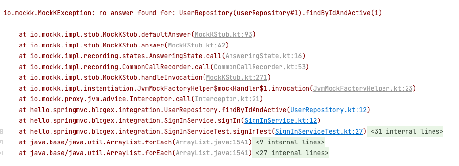
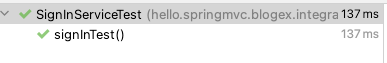
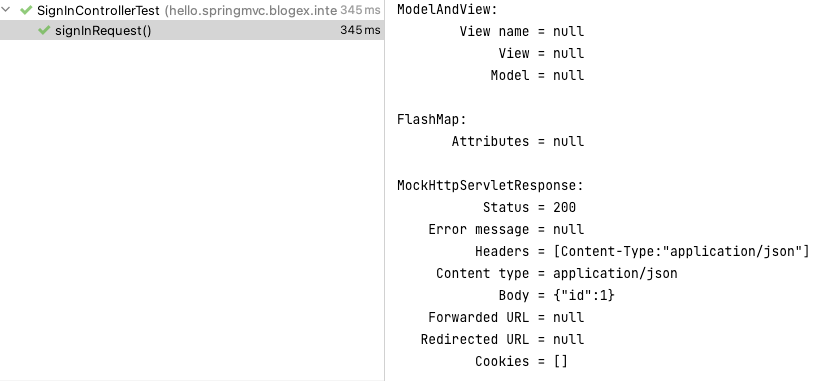

# Springboot 통합 테스트로 불안한 리팩토링에서 벗어나기
통합테스트를 작성한 경험을 기록했습니다. 아래와 같은 순서로 말해보겠습니다.

- 통합테스트 작성 계기
- 웹 레이어 테스트와 통합테스트
- 웹 레이어 테스트 작성
- 통합 테스트 작성
- 군말

## 통합 테스트 작성 계기
제가 참여하는 프로젝트는 구조를 크게 3계층으로 나눌 수 있습니다. 아주 흔한 구조입니다.

- Web
- Service
- Repository

저는 이중에서 서비스 레이어에 대한 단위 테스트만 집중해서 작성했습니다. (모든 레이어를 꼼꼼하게 테스트해야 한다고 생각하지만 내부적인 협의점이 그것이었습니다.)
라이브러리에 의존하는 단위 테스트를 하면서 가장 불편했던 점은 프로덕션 코드를 변경하면 테스트 코드를 함께 변경해야 한다는 것이었습니다.

간단한 예시를 들어보겠습니다. 불필요한 부분은 생략하겠습니다.
```kotlin
//제품 코드
fun signIn(userId: Long) {
	val user = userRepository.findByIdOrNull(userId) ?: User.EMPTY
	
	return user
}

---
//테스트 코드
@ExtendWith(MockKExtension::class)
internal class SignInServiceTest {

    @MockK
    private lateinit var userRepository: UserRepository
    private lateinit var signInService: SignInService

    @BeforeEach
    fun setUp() {
        signInService = SignInService(userRepository)
    }

    @Test
    fun signInTest() {
        every { userRepository.findByIdOrNull(any()) } returns null

        val actual = signInService.signIn(1)

        assertThat(actual).isEqualTo(User.EMPTY)
    }
}
```

로그인 함수에 대한 간단한 테스트입니다.
그런데 사용자를 조회할 때 탈퇴하지 않은 사용자만 조회되어야 한다는 요구사항이 추가된다면 어떻게 해야 할까요? `userRepository.findByOrNull()` 메소드가 아닌 `userRepository.findByIdAndActive()`  메소드를 이용하도록 수정해야 합니다.

```kotlin
//제품 코드
fun signIn(userId: Long) {
	val user = **userRepository.findByIdAndActive**(userId) ?: throw User.EMPTY
	
	return user
}
```

위와 같이 제품 코드를 수정했습니다.
그리고 좀전에 작성했던 테스트 코드를 다시 돌려보면 아래와 같은 에러가 발생하면서 실패합니다.




```
io.mockk.MockKException: no answer found for: UserRepository(userRepository#1).findByIdAndActive(1)
```

`findByIdAndActive()`  이 무엇을 해야하는지 아직 정의되지 않았을 때, 즉 메소드 스텁을 해주지 않았을 때 발생하는 예외입니다.

테스트 코드에도 변경사항을 반영해줍니다.
```kotlin
@Test
fun signInTest() {
    every { userRepository.findByIdAndActive(any()) } returns null
//  every { userRepository.findByIdOrNull(any()) } returns null
    val actual = signInService.signIn(1)

    assertThat(actual).isEqualTo(User.EMPTY)
}

```

그 다음 다시 테스트를 돌려보면 통과합니다.




이처럼 Mock 라이브러리와 함께 단위테스트를 진행하면 메소드 내부에서 참조하는 메소드의 행동을 지정해주어야 하기 때문에, 프로덕션 코드를 수정할 때 테스트 코드를 함께 수정해주어야 하는 번거로움이 있습니다. Test-first하게 개발하는 데는 도움이 될 수 있으나 가끔 놓치고 뒤늦게 테스트가 깨진다는 사실을 발견할 때도 있습니다.

소위 화이트박스 테스트라고 불리는 이 방식은 (특히 분기문이 있을 때) 의도한 대로 로직이 작동하는지 검증할 때 유용합니다. 하지만 위에서 말씀드린 것처럼 로직을 어떻게 타는지 테스트가 알고 있기 때문에 테스트와 프로덕션 코드 간에 보이지 않는 결합이 형성됩니다.

또한 단위 테스트는 하나의 메소드만을 검증합니다. 하나의 기능이 동작하기 위해 필요한 많은 컴포넌트 중 하나의 컴포넌트가 잘 동작하고 있느냐를 검증한다는 뜻이지요. 모든 컴포넌트가 제대로 동작하고 있다는 것을 검증해도, 그것의 합이 정상적으로 동작한다는 보장도 없습니다. 순서에 따라 결과가 달라질 수 있기 때문이죠.

작은 실수 때문에 코드를 몇 줄 수정했을 뿐인데 API가 망가진 일이 몇 번 벌어지자 API 통합 테스트가 필요하다고 생각했습니다. 어떻게 구현되어 있든, 내가 개발한 API를 호출한 예상한 결과를 반환하는지가 궁금했습니다. 그것을 자동화하고, 커밋 전에 눈으로 확인해서, 코드 변경의 두려움을 덜어내려고 했습니다.

## 웹 레이어와 통합 테스트
통합(integration) 테스트에서 ‘통합’이라는 말이 헷갈립니다. 여기서 ‘통합’이란 무엇을 이야기하는 걸까요? 위키피디아에서는 개별 소프트웨어 모듈을 그룹으로 묶어서 테스트하는 테스트의 한 단계라고 정의합니다. 제가 내린 결론은 ‘정의하기 나름’입니다. 어떤 분들은 스프링 컨텍스트가 올라가면 통합테스트라고 부르는 분도 있고, Web~Repository 모든 레이어를 한 번에 테스트하는 것을 통합테스트라고 부르기도 하는 듯합니다.

그것이 통합 테스트냐, 단위 테스트냐에 대한 구분은 크게 중요하지 않아보입니다. 그것은 단지 용어일 뿐입니다. 중요한 것은 내가 무엇을 테스트 하려고 하는지 정의하는 것입니다.

제가 검증하고 싶었던 것은 위에서 말씀드렸다시피 ‘API를 호출하면 예상한 결과를 반환하는가?’입니다. Spring boot에서는 두 가지 방식으로 할 수 있을 것 같습니다.

1.  `@WebMvcController`
2.  `@SpringBootTest`

1번 `@WebMvcController` 의 경우 SpringMVC 관련 구성만 컨테이너에 올리기 때문에 Web 레이어를 테스트하기에 알맞습니다. 또한 원하는 Controller만 로딩할 수 있기 때문에 `@SpringBootTest` 에 비해 가볍고 빠릅니다.

2번 `@SpringBootTest` 의 경우 스프링 컨텍스트를 통째로 올리기 때문에 Web~Repository 모든 레이어를 테스트할 때 좋은 것 같습니다.

설명 편의를 위해서  `@WebMvcTest` 는 웹 레이어를 테스트하는 도구, `@SpringBootTest` 모든 레이어롤 통합해서 테스트하는 도구라고 지칭하겠습니다.


## 웹 레이어 테스트 작성하기
둘 다 테스트 하는 방법은 거의 동일합니다. 다만 `@WebMvcTest` 는 서비스 레이어를 사용하기 위해 모의 객체를 사용해야 합니다.

**SignInController**
```kotlin
@RestController
class SignInController(
    private val signInService: SignInService
) {
    @PostMapping("/sign-in")
    fun signIn(
        @RequestBody id: Long
    ): User {
        val user = signInService.signIn(userId = id)

        return user
    }
}
```

**SignInControllerTest**
```kotlin
@ExtendWith(MockKExtension::class)
@WebMvcTest(controllers = [SignInController::class])
internal class SignInControllerTest {

    @Autowired
    private lateinit var mockMvc: MockMvc

    @MockkBean
    private lateinit var signInService: SignInService

    @Test
    fun signInRequest() {
        //given
        val idJson = 1

        every { signInService.signIn(any()) } returns User.TEMP

        //when
        val response = mockMvc.post("/sign-in") {
            contentType = MediaType.APPLICATION_JSON
            content = idJson
        }


        response.andExpect {
            status { isOk() }
            jsonPath("$['id']") { value(1) }
        }.andDo { print() }
    }
}
```

이렇게 작성하고 테스트를 실행하면 통과합니다.



> **주의**
> 
> 흔히 부트스트랩이라 불리는, Spring 애플리케이션을 실행하는 클래스에 Jpa, Redis, Cloud 등의 애노테이션이 붙어있다면 스프링 컨텍스트는 실행되면서 그 구성까지 읽어오려고 합니다. 하지만 `@WebMvcTest` 는 Spring MVC 관련 구성만 로딩하기 때문에 구성을 찾을 수 없다는 예외가 발생합니다. 따라서 해당 애노테이션 구성 설정은 별도의 클래스에서 구성하는 것으로 분리해야 합니다.


## 통합 테스트 작성하기
`@SpringBootTest` 를 이용한 통합 테스트를 작성해보겠습니다.
데이터베이스까지 올려서 테스트 하는 경우에 인메모리 데이터베이스인 H2를 자주 사용하는 것 같습니다. 저는 이번에는 별도로 H2를 구성하지 않았고 기존에 사용하던 mysql에 테스트 스키마를 만들어서 진행했습니다. H2가 JSON 컬럼을 지원하지 않았고, 우회하기 위해 프로덕션 코드에 수정이 필요했습니다. 그래서 그냥 MySQL에 테스트 전용 스키마를 만드는 방법을 선택했습니다.

`@SpringBootTest` 를 사용하다보면 여러 테스트 클래스에 중복되는 애노테이션 구성들이 생깁니다. 저는 이것을 모두 감싸는 애노테이션을 만들었습니다.

```kotlin

@Import(IntegrationTestConfig::class)
@Sql("classpath:db/init.sql", executionPhase = Sql.ExecutionPhase.BEFORE_TEST_METHOD)
@ActiveProfiles("test")
@AutoConfigureMockMvc
@SpringBootTest(webEnvironment = SpringBootTest.WebEnvironment.MOCK)
annotation class IntegrationTest
```

여기서 `@Sql` 애노테이션에서 지정한 `init.sql` 파일 안에 스키마 생성문을 작성해두었는데 예상한 대로 작동하지 않았습니다. 저는 그래서 테스트 시작 전에 별도로 직접 테스트 스키마를 생성했습니다.
아래는 간단한 테스트 구성입니다.

**application-test.properties**
```
spring.jpa.hibernate.ddl-auto=create-drop
spring.jpa.show-sql=true

spring.datasource.hikari.jdbc-url=jdbc:mysql://127.0.0.1:3306/testdb?zeroDateTimeBehavior=convertToNull&useUnicode=true&characterEncoding=utf8&character_set_server=utf8mb4&useSSL=false&serverTimezone=Asia/Seoul
spring.datasource.driverClassName=com.mysql.cj.jdbc.Driver
```


**IntegrationTestConfig**
```
@Configuration
class IntegrationTestConfig {

    /**
     * APPLICATION_JSON_UTF8_VALUE deprecate되면서 응답값 한글 인코딩 깨지는 현상 직접 빈으로 생성해서 해결
     */
    @Bean
    fun characterEncodingFilter(): CharacterEncodingFilter {
        return CharacterEncodingFilter("UTF-8", true)
    }

}

```

프로덕션 컨트롤러 코드는 `@WebMvcTest`  예시와 동일합니다.
```kotlin
@RestController
class SignInController(
    private val signInService: SignInService
) {
    @PostMapping("/sign-in")
    fun signIn(
        @RequestBody id: Long
    ): User {
        val user = signInService.signIn(userId = id)

        return user
    }
}
```


**테스트 코드**

```kotlin
@Import(IntegrationTestConfig::class)
@ActiveProfiles("test")
@AutoConfigureMockMvc
@SpringBootTest(webEnvironment = SpringBootTest.WebEnvironment.MOCK)
internal class SignInControllerIntegrationTest {

    @Autowired
    private lateinit var mockMvc: MockMvc

    @Autowired
    private lateinit var userRepository: UserRepository

    @Test
    fun signInRequest() {
        //given
        val idJson = 1
        //직접 DB에 저장해야 한다.
        val savedUser = userRepository.save(User(name = "hoon"))

        //when
        val response = mockMvc.post("/sign-in") {
            contentType = MediaType.APPLICATION_JSON
            content = idJson
        }

        //then
        response.andExpect {
            status { isOk() }
            jsonPath("$['id']") { value(savedUser.id) }
        }.andDo { print() }
    }
}
```

테스트 코드도 거의 유사합니다. 다만 여기서는 서비스 레이어에 대한 모의 객체를 생성하는 부분이 없습니다. 모든 레이어를 올려서 테스트하기 때문에 실제와 같은 환경이 만들어지기 때문입니다. 모의객체를 사용하지 않기 때문에 직접 `UserRepository` 를 받아와서 `User` 를 먼저 데이터베이스에 저장하는 것이 선행되어야 합니다. 그래야 사용자를 조회할 수 있습니다.

`MockMvc` 를 통해 원하는 다양한 요청을 할 수도 있고, 예상한 예외가 돌아오는지 모두 테스트할 수 있습니다. 자세한 것은 [스프링 공식 문서](https://docs.spring.io/spring-framework/docs/current/reference/html/testing.html#spring-mvc-test-framework)가 도움이 될 것입니다.

간단하게 예제를 만들었지만, 현실 세계의 코드는 훨씬 복잡합니다. 하나의 API에서 여러 응답이 돌아올 수 있구요. API 단위로 `@Nested` 테스트를 진행하시면 좀 더 가독성 좋은 테스트를 만들 수도 있을 것 같습니다.

저는 이런 식으로 정상 케이스, 예외 케이스들을 모두 만들어서 통합테스트를 진행했습니다. 단위 테스트만 있을 때보다도 훨씬 더 자유롭게 코드를 수정할 수 있었습니다. 왜냐하면 내가 변경한 뒤에도 API과 이전과 똑같이 동작하느냐를 테스트가 보장하기 때문입니다. 예상하지 못한 예외가 발생하면 어떡하지?라는 두려움이 이전보다 대폭 줄었습니다. 앞으로 정신 건강을 위해서라도 통합 테스트까지 꼼꼼하게 작성하려고 합니다.


## 군말
앞으로 API 단위로 개발을 진행한다면, 그 기능에 필요한 메서드들은 TDD로 구현하고, 마지막으로 통합 테스트를 작성해서 완전하다는 것을 테스트하는 방식으로 개발을 해보고 싶습니다. 사실 이 생각은 전부터 했는데, 막상 개발에 들어가게 되면 기능 구현에 급급해서 테스트를 어느 순간 잊는 것 같습니다. 다시 한 번 반성하고 테스트를 이용한 안정성 있는 코드를 만드는 일에 집중해봐야겠습니다.


